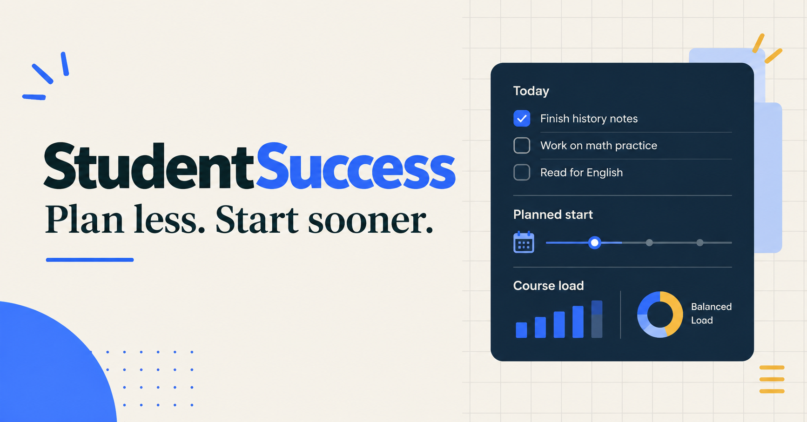
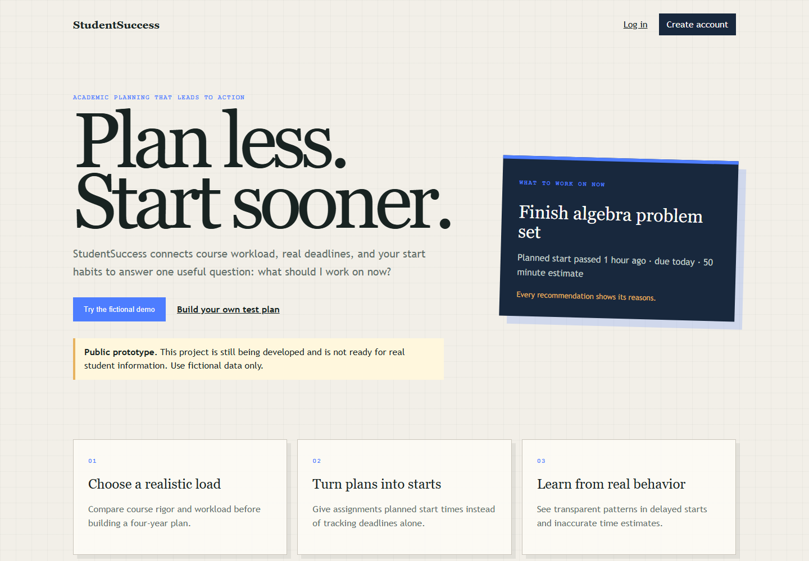
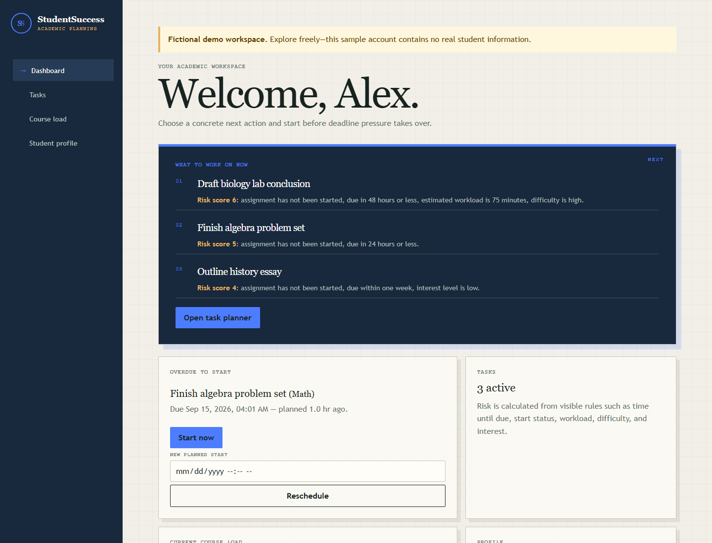

# StudentSuccess

> **Public prototype:** StudentSuccess is still under development and is not ready to store real student information. Use fictional data only when exploring the live demo.

StudentSuccess is a procrastination-aware workload and action planner for high-school students. It helps students choose a manageable course load, decide what to work on now, and start assignments before deadline pressure creates urgency.

**[Open the live prototype](https://studentsuccess.onrender.com/)** and choose **Create a private planner** for a server-saved workspace with a random access code, or **Try the fictional demo** for an isolated, pre-populated workspace. No name or email is needed for a private-code planner. Save the code: anyone who has it can access the plan, and lost codes cannot be recovered. Every private-code account opens the full dashboard and course catalog. An optional browser-only workspace is linked beneath code creation and remains separate from server accounts. Free-text submissions require confirmation that they contain no personal information.

> The free Render service can take up to a minute to wake after inactivity. The demo uses fictional data and is intended for product exploration, not real student records.







## What problem does it address?

The project aims to help a student choose what to work on now, compare planned and actual start times, recognize repeated delay patterns, and eventually build more realistic schedules from real behavior.

## Implemented

- Flask application factory and Blueprints
- Student onboarding and editable profile stored in SQLite
- A profile-aware dashboard with a real recommended next task
- A catalog-aware course explorer with state selection, national reference courses, imported state catalogs, AP/IB program catalogs, and a Forsyth County local catalog
- Course explorer with search, filters, details, comparison, prerequisites, and four-year planning
- Task creation, planned/actual start tracking, completion, and explainable rule-based risk
- Automated route, task, risk, and course-service tests
- Public landing page and isolated one-click fictional demo workspaces
- Account-backed accessibility settings for themes, text size and spacing, reduced motion, focus mode, dashboard density, and optional cards
- Personalized task defaults, time zones, date formats, user-controlled in-app reminders, snoozing, and calendar export
- Data export, completed-history clearing, password changes, and full account deletion
- A guided fictional-demo tour, friendly error recovery pages, and social-sharing metadata

Machine learning, AI assistance, optimization, and calendar integration are not implemented. State selection is available for all 50 states, with imported data for Alabama, Arkansas, Florida, Georgia/Forsyth, Illinois, Indiana, Iowa, Kansas, Kentucky, Louisiana, Michigan, Minnesota, Mississippi, Missouri, Nebraska, North Carolina, North Dakota, Ohio, South Carolina, South Dakota, Tennessee, Virginia, West Virginia, and Wisconsin. Coverage varies by supplied source. The national and AP/IB catalogs are planning references, not universal graduation or placement authorities.

## Technology

- Python and Flask
- Flask-SQLAlchemy with SQLite locally and PostgreSQL in persistent deployments
- HTML and CSS
- pytest

## Important limitations

- StudentSuccess is a prototype. Do not enter real student or school-record data.
- Workload, rigor, risk, and priority labels are transparent planning estimates, not official academic advice.
- Course offerings and requirements vary by school and must be confirmed with a school counselor.
- The project does not currently use artificial intelligence or claim to make predictive decisions.

## Accessibility and personalization

Signed-in users can open **Settings** from the dashboard to personalize the
interface and planning experience. Every page includes a keyboard skip link,
visible focus indicators, support for browser text enlargement, device-level
reduced-motion preferences, and account-specific appearance settings. Focus
mode reduces the dashboard to the recommended next action. Reminder settings
are opt-in and respect quiet hours.

## Local setup

1. Create and activate a virtual environment.
2. Install dependencies:

   ```powershell
   pip install -r requirements.txt
   ```

3. Start the development server:

   ```powershell
   python app.py
   ```

4. Open `http://127.0.0.1:5000`.

The app creates missing tables in `instance/studentsuccess.db`. This local database is ignored by Git.

To run tests:

```powershell
python -m pytest
```

## Public demo launch

The app is configured for Render with `render.yaml`. Use a Render **Web Service**
with the Free compute plan, then confirm these commands if entering the service
manually:

```text
Build: pip install -r requirements.txt
Start: gunicorn app:app
```

Before sharing the link, set `SECRET_KEY` in the host environment and use only
fictional demo data. The included `scripts/seed_test_login.py` creates a
populated local test account for screenshots and walkthroughs; it is not a
production account and should not be used with real student information.

The Render blueprint disables `DEMO_RESET_ON_DEPLOY` and connects the web
service to the managed `studentsuccess-db` PostgreSQL database, so deployments
do not delete accounts and service restarts do not lose them. If the service was
created before this database was added to `render.yaml`, apply the blueprint
update in Render and confirm that `DATABASE_URL` is linked to
`studentsuccess-db`. Without that connection, the app falls back to SQLite,
whose filesystem is temporary on Render.

The `/health` endpoint returns `{"status": "ok"}` for deployment checks.

Render's free service sleeps after inactivity and its local SQLite filesystem is
temporary, so this deployment is suitable for a portfolio demo rather than
reliable long-term data storage.

## License

StudentSuccess is available under the [MIT License](LICENSE).

## Project structure

```text
StudentSuccess/
|-- app.py
|-- config.py
|-- extensions.py
|-- data/
|   `-- courses.json
|-- docs/
|-- instance/
|-- models/
|-- routes/
|-- services/
|-- static/css/
|-- templates/
`-- tests/
```

- `models/` defines persisted application data.
- `routes/` handles browser requests through Flask Blueprints.
- `services/` contains reusable logic and catalog access.
- `templates/` and `static/` provide the server-rendered interface.
- `data/` contains the curated course catalog.

## Short roadmap

Near-term work includes long-term hosting, stronger public-form protections, richer links between planned courses and assignments, and broader usability testing with fictional scenarios. Adaptive scheduling, optimization, or machine learning should only be considered after useful real behavior data exists.
