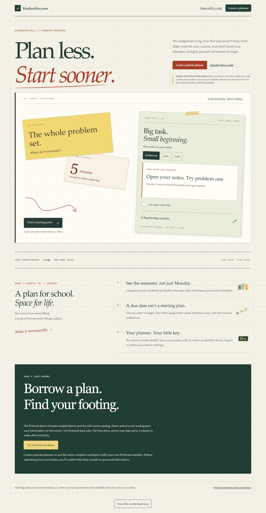
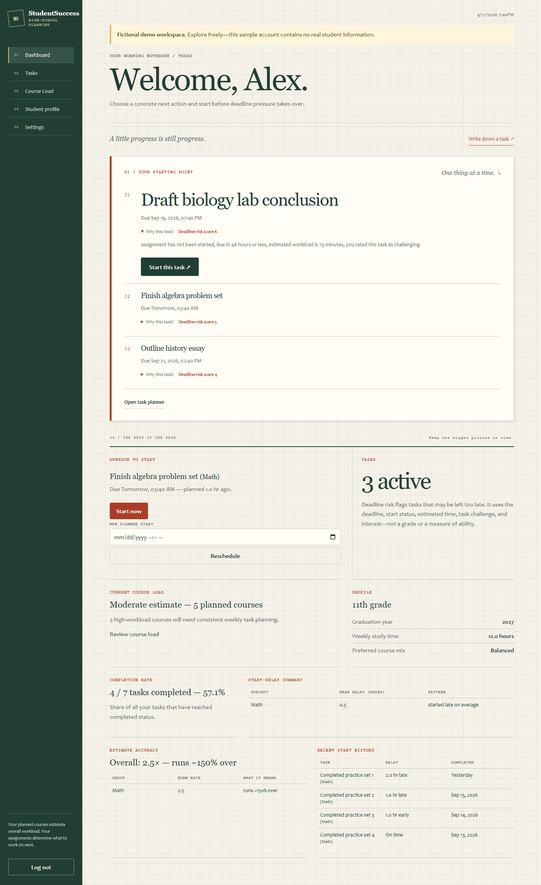

# StudentSuccess

**Plan less. Start sooner.**

StudentSuccess helps high-school students plan a manageable course load and decide which assignment to start next. It brings together four-year course planning, explained task priorities, and feedback on planned versus actual start times.

**[Try the live demo](https://studentsuccess.onrender.com/)** · [Data sources](docs/data_sources.md) · [Privacy notes](docs/privacy_notes.md) · [Architecture](docs/architecture.md)

> Public prototype: explore with fictional information only. The demo server may take about a minute to wake after inactivity.

## Take a look

[View all eight screenshots](docs/screenshots/README.md), including tasks, course comparisons, the four-year plan, settings, and a mobile dashboard detail.

## What you can do

- **Choose what to start next.** See task recommendations with plain-language reasons based on deadlines, estimated effort, task ratings, and available start-history patterns.
- **Turn deadlines into a starting plan.** Set planned start times, start and complete tasks, record actual duration, and review timing and estimation patterns. Recurring tasks and optional in-app reminders support ongoing work.
- **Compare course options.** Search reference catalogs, inspect prerequisites, compare up to three courses, and build a four-year plan with workload estimates.
- **Make the workspace easier to use.** Adjust themes, text size and spacing, reduced motion, focus mode, dashboard density, and visible cards.
- **Keep control of your plan.** Export account data, download a calendar file, clear completed history, or delete your account.

Recommendations use explicit rules. StudentSuccess does not currently use AI or machine learning.

## Try a workspace

| Option | How it works |
| --- | --- |
| **Fictional demo** | Open an isolated workspace with sample tasks and history. A short tour introduces the main features. |
| **Private planner** | Create a server-saved planner without a name or email. Save the generated private code to reopen it on another device. |
| **Browser-only planner** | Use the optional browser workspace linked below planner creation. Download and restore backups to move your plan manually. |

Anyone with a private code can access its planner. Lost codes cannot be recovered. Browser-only plans are separate from server accounts and do not sync automatically. Existing username/password accounts remain supported.

Free-text submissions ask you to confirm that they contain no personal information. This is a user acknowledgment, not automatic detection. See the [privacy notes](docs/privacy_notes.md) for storage and account details.

## Course references and limits

The explorer offers state selection for all 50 states, national reference courses, AP and IB catalogs, and selected local course references. Imported state coverage varies; selecting a state does not mean a complete statewide catalog is available. The [data sources](docs/data_sources.md) document coverage and provenance.

Academic depth, workload, and task-priority labels are planning estimates. Confirm current offerings, prerequisites, and graduation requirements with your school counselor. This prototype is not ready to hold real student records.

## Next steps

Priorities include more reliable hosting, stronger public-form protections, clearer connections between planned courses and assignments, and usability testing with fictional scenarios. Adaptive scheduling and optimization remain future work. Calendar-file export is available; live calendar synchronization is not implemented.

## License

[MIT](LICENSE)
