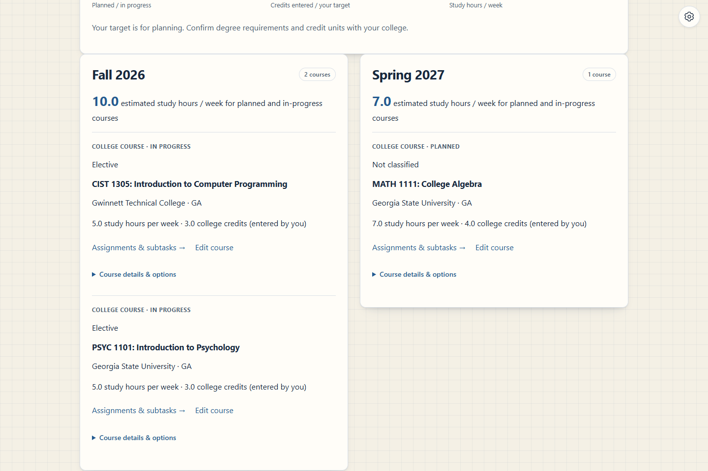

# StudentSuccess

**Plan less. Start sooner.**

StudentSuccess is an academic planner for high school and college students. It connects course planning with daily assignments: choose a manageable workload, break projects into steps, and see an explained recommendation for what to start next.

**[Open StudentSuccess](https://studentsuccess.onrender.com/)** | [Screenshot gallery](docs/screenshots/README.md) | [Project updates](https://studentsuccess.onrender.com/updates)

Choose **Start tutorial** on the live site for a guided, interactive practice workspace. No registration is required for the tutorial.

## What it does

- **AI step drafts (beta).** Turn assignment instructions into a reviewed task and steps, or break down an existing assignment with Groq. Edit the draft and explicitly save the steps you choose. Requires server configuration; task ranking remains deterministic. [Setup and data handling](docs/ai-planning.md).

- **Explained task priorities.** Recommendations combine urgency tiers with explicit scoring rules for deadlines, effort, challenge, interest, and available start history. Students can inspect the reasoning; no AI or machine learning is involved.
- **An organized task workspace.** Search tasks, switch between a prioritized queue and course groups, open parent assignments from subtasks, and keep completed work separate.
- **Manageable projects.** Add subtasks or split an assignment into timed work blocks. Track progress and optional actual minutes; estimates support up to 10,080 minutes.
- **Flexible scheduling.** Reschedule from the task menu, use timezone-aware shortcuts, and undo a schedule change. Repeating assignments run through an inclusive end date; each occurrence can be edited independently. Reuse a task as a template or select multiple tasks for reviewed deletion.
- **High school and dual enrollment.** Explore reference courses, compare up to three options, and build a four-year plan. Add college courses directly alongside high school courses.
- **College planning across institutions.** Organize courses by term, credits, requirement category, and study workload. Each course can belong to a different college. Search the bundled IPEDS 2024 directory of 5,994 institutions by name or state.
- **Five-minute focus sessions.** Start a task with a short timer, pause or resume it, and work in a distraction-free view. Park distracting thoughts in per-tab notes; neither timer completion nor notes change task completion or recorded minutes.
- **Progress feedback.** Review completed work, planned versus actual starts, and time estimates through summaries and graphs.
- **Calendar tools.** Add a task deadline to Google Calendar, export active deadlines as an ICS file, or review assignments imported from a calendar file. These are manual copies, not automatic two-way sync.
- **Personalization and accessibility.** Required onboarding sets education context, timezone, study budget, and preferences. Light, dark, and high-contrast themes, adjustable text and spacing, focus settings, and reduced-motion support adapt the notebook interface.
- **Control over account data.** Export your data, clear completed history, or delete your account from Settings.

For an image-led walkthrough, visit the **[product showcase](https://github.com/JVijay08/StudentSuccess-showcase)**. This repository contains the application source, setup instructions, and technical documentation.

## See the current site

Screenshots refreshed **September 30, 2026**, using isolated synthetic sample data. Desktop captures are 1440 x 960 (3:2); mobile captures are 390 x 844. These are actual application renders, not mockups.

| Task planning | Integrated dual enrollment |
| --- | --- |
|  |  |

| Project steps | College term planning |
| --- | --- |
|  |  |

[Browse all 20 screenshots](docs/screenshots/README.md), including the landing page, comparisons, four-year plan, Calendar tools, personalization, tutorial, and mobile views.

## Try it

1. Visit [the live site](https://studentsuccess.onrender.com/) and choose **Start tutorial** to explore an isolated practice account. The guide demonstrates real controls; exiting removes the practice data.
2. For a persistent planner, create a nickname-style username and password, then complete onboarding. No email, full name, or student ID is required.
3. Add courses and assignments, then use the dashboard to choose a next step.

Save your credentials: email password recovery is not available. Actual course names and everyday tasks are welcome; leave out full names, student IDs, contact details, and sensitive records. The entry acknowledgment is not automatic detection or redaction.

The optional [/planner](https://studentsuccess.onrender.com/planner) workspace stores its plan in the browser. It is separate from server accounts and does not automatically sync with them. Legacy private-code users have a one-time transfer path; private codes are not the current sign-in method.

## How recommendations work

Active leaf tasks are ordered by **in progress > overdue > missed planned start > due within 24 hours > upcoming**. Within a tier, the score considers deadlines, estimated effort, challenge, interest, and sufficient recorded start history. Deadline, planned start, and stable task identifiers break remaining ties.

Tiers take precedence over scores. For example, a missed planned start can rank above a task due within 24 hours. That tradeoff is documented for further student testing.

- [Priority and tier rules](services/task_policy.py)
- [Score calculation](services/procrastination_service.py)
- [Recommendation ordering and explanations](services/suggestion_service.py)
- [Ranking policy and evaluation plan](docs/ranking-policy-review.md)

## Run locally

Requires **Python 3.11+**. SQLite is used locally; the Render deployment uses PostgreSQL.

~~~bash
git clone https://github.com/JVijay08/StudentSuccess.git
cd StudentSuccess
python -m venv .venv
~~~

Activate the environment:

~~~bash
# macOS / Linux
source .venv/bin/activate
~~~

~~~powershell
# Windows PowerShell
.venv/Scripts/Activate.ps1
~~~

Then install and run:

~~~bash
python -m pip install -r requirements.txt
python -m flask --app app run
~~~

Open http://127.0.0.1:5000. Startup creates the local database in instance/studentsuccess.db. Create a local account or start the tutorial; no hosted-account credentials are needed.

### Checks and screenshots

~~~bash
python -m pytest
python -m pip install playwright
python scripts/capture_project_media.py
~~~

The screenshot script requires installed Google Chrome, creates a disposable in-memory database, and refreshes docs/screenshots/. It does not connect to production or use real accounts. Targeted browser checks live in scripts/check_*.py.

### Deployment

[render.yaml](render.yaml) describes the Flask/Gunicorn service and PostgreSQL database. Production requires a stable SECRET_KEY, persistent DATABASE_URL, and APP_ENV=production. Keep DEMO_RESET_ON_DEPLOY=0 for persistent accounts. Set PUBLIC_SITE_URL to the deployed origin if it differs from the default.

## Scope and limits

Course catalogs include national references, AP/IB, and selected state/local sources. Coverage varies; a state filter does not promise a complete statewide catalog. Some imported entries are held out pending source verification. The institution directory is not a complete database of every college's courses; students can enter their own course details.

Workload labels and recommendations are planning aids, not official academic advice, graduation audits, or admissions predictions. Verify offerings and requirements with your institution. Future work includes catalog verification, continued usability testing, and evaluating scheduling tradeoffs. AI step drafting is available when configured; automatic Calendar synchronization is not implemented.

## Technical details

Built with **Flask, Jinja, SQLAlchemy, PostgreSQL/SQLite, and vanilla JavaScript/CSS**. The interface uses graph paper, layered surfaces, clear controls, and motion that respects reduced-motion preferences.

- [Architecture](docs/architecture.md)
- [Account setup](docs/account-setup.md) and [privacy notes](docs/privacy_notes.md)
- [Course data sources](docs/data_sources.md) and [college planning](docs/college-planning.md)
- [Tutorial, recurrence, and Calendar behavior](docs/tutorial-and-calendar.md)
- [SEO configuration](docs/seo.md)
- [Feedback implementation record](docs/feedback-test-1-implementation.md) - dated engineering history

## License

[MIT](LICENSE)

Public notices: [Privacy](https://studentsuccess.onrender.com/privacy), [Terms](https://studentsuccess.onrender.com/terms-of-service), [Cookies](https://studentsuccess.onrender.com/cookies), [Data deletion](https://studentsuccess.onrender.com/data-deletion), and [Accessibility](https://studentsuccess.onrender.com/accessibility). See the [privacy/accessibility audit](docs/privacy-accessibility-audit.md) for implementation details and outstanding owner setup, including the inactive contact placeholder.
