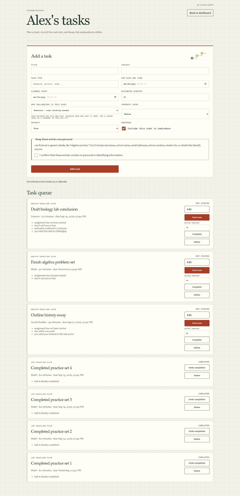
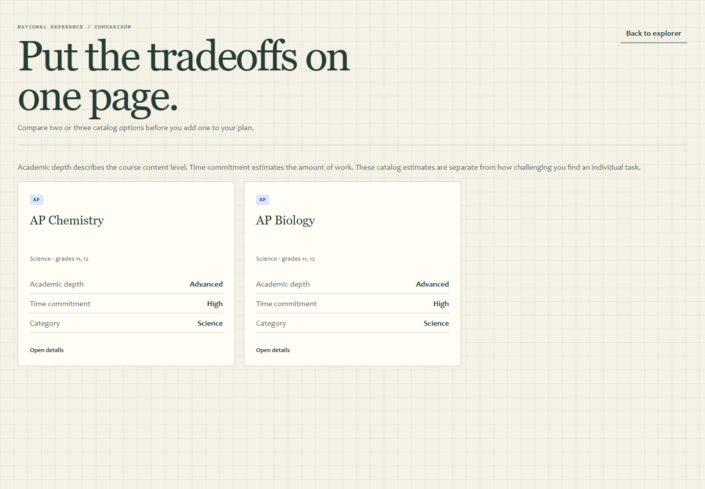
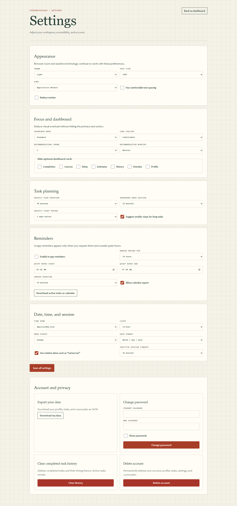
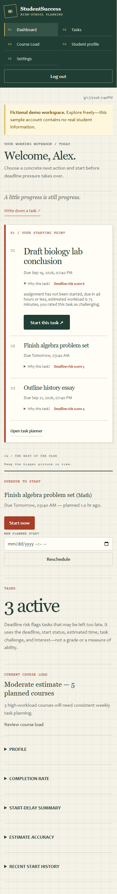

# StudentSuccess screenshots

[Back to the project README](../../README.md)

Captured September 17, 2026 from the redesigned app running locally with isolated fictional demo data. Desktop captures are 1440 pixels wide; the mobile capture is 390 pixels wide. Open an image at full size to read the longer pages. Recreate the captures with `python scripts/capture_fieldnotes.py` (requires Playwright and Chrome).

## Landing page

Entry points for private planners and the fictional demo.

## Dashboard

Explained next actions, due dates, workload, and start-history summaries.

## Task planner

Task entry and a queue of fictional assignments with start and completion controls.

## Course explorer

National reference catalog with filters and course cards.

## Course comparison

AP Chemistry and AP Biology references shown side by side.

## Four-year plan

The demo has five courses in grade 11; the other years are empty.

## Settings

Appearance, focus, planning, reminders, date/time, and account controls.

## Mobile dashboard

The full mobile dashboard, including navigation, clock, task recommendations, and expandable summaries.

